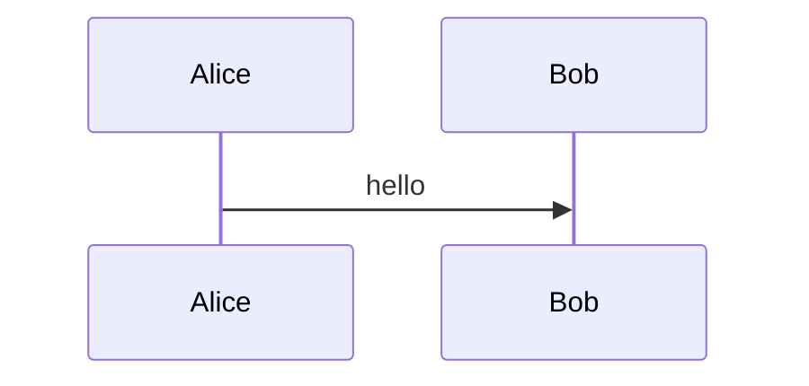
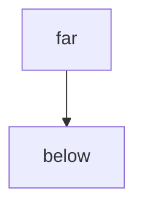

# Diagrams

Two diagrams near the top, one that does not parse, and one far below the fold.




```mermaid
flowchart LR
  A -. .-> B
```

Filler paragraph 1, so that the last diagram starts well outside the first two viewports.

Filler paragraph 2, so that the last diagram starts well outside the first two viewports.

Filler paragraph 3, so that the last diagram starts well outside the first two viewports.

Filler paragraph 4, so that the last diagram starts well outside the first two viewports.

Filler paragraph 5, so that the last diagram starts well outside the first two viewports.

Filler paragraph 6, so that the last diagram starts well outside the first two viewports.

Filler paragraph 7, so that the last diagram starts well outside the first two viewports.

Filler paragraph 8, so that the last diagram starts well outside the first two viewports.

Filler paragraph 9, so that the last diagram starts well outside the first two viewports.

Filler paragraph 10, so that the last diagram starts well outside the first two viewports.

Filler paragraph 11, so that the last diagram starts well outside the first two viewports.

Filler paragraph 12, so that the last diagram starts well outside the first two viewports.

Filler paragraph 13, so that the last diagram starts well outside the first two viewports.

Filler paragraph 14, so that the last diagram starts well outside the first two viewports.

Filler paragraph 15, so that the last diagram starts well outside the first two viewports.

Filler paragraph 16, so that the last diagram starts well outside the first two viewports.

Filler paragraph 17, so that the last diagram starts well outside the first two viewports.

Filler paragraph 18, so that the last diagram starts well outside the first two viewports.

Filler paragraph 19, so that the last diagram starts well outside the first two viewports.

Filler paragraph 20, so that the last diagram starts well outside the first two viewports.

Filler paragraph 21, so that the last diagram starts well outside the first two viewports.

Filler paragraph 22, so that the last diagram starts well outside the first two viewports.

Filler paragraph 23, so that the last diagram starts well outside the first two viewports.

Filler paragraph 24, so that the last diagram starts well outside the first two viewports.

Filler paragraph 25, so that the last diagram starts well outside the first two viewports.

Filler paragraph 26, so that the last diagram starts well outside the first two viewports.

Filler paragraph 27, so that the last diagram starts well outside the first two viewports.

Filler paragraph 28, so that the last diagram starts well outside the first two viewports.

Filler paragraph 29, so that the last diagram starts well outside the first two viewports.

Filler paragraph 30, so that the last diagram starts well outside the first two viewports.

Filler paragraph 31, so that the last diagram starts well outside the first two viewports.

Filler paragraph 32, so that the last diagram starts well outside the first two viewports.

Filler paragraph 33, so that the last diagram starts well outside the first two viewports.

Filler paragraph 34, so that the last diagram starts well outside the first two viewports.

Filler paragraph 35, so that the last diagram starts well outside the first two viewports.

Filler paragraph 36, so that the last diagram starts well outside the first two viewports.

Filler paragraph 37, so that the last diagram starts well outside the first two viewports.

Filler paragraph 38, so that the last diagram starts well outside the first two viewports.

Filler paragraph 39, so that the last diagram starts well outside the first two viewports.

Filler paragraph 40, so that the last diagram starts well outside the first two viewports.

Filler paragraph 41, so that the last diagram starts well outside the first two viewports.

Filler paragraph 42, so that the last diagram starts well outside the first two viewports.

Filler paragraph 43, so that the last diagram starts well outside the first two viewports.

Filler paragraph 44, so that the last diagram starts well outside the first two viewports.

Filler paragraph 45, so that the last diagram starts well outside the first two viewports.

Filler paragraph 46, so that the last diagram starts well outside the first two viewports.

Filler paragraph 47, so that the last diagram starts well outside the first two viewports.

Filler paragraph 48, so that the last diagram starts well outside the first two viewports.

Filler paragraph 49, so that the last diagram starts well outside the first two viewports.

Filler paragraph 50, so that the last diagram starts well outside the first two viewports.

Filler paragraph 51, so that the last diagram starts well outside the first two viewports.

Filler paragraph 52, so that the last diagram starts well outside the first two viewports.

Filler paragraph 53, so that the last diagram starts well outside the first two viewports.

Filler paragraph 54, so that the last diagram starts well outside the first two viewports.

Filler paragraph 55, so that the last diagram starts well outside the first two viewports.

Filler paragraph 56, so that the last diagram starts well outside the first two viewports.

Filler paragraph 57, so that the last diagram starts well outside the first two viewports.

Filler paragraph 58, so that the last diagram starts well outside the first two viewports.

Filler paragraph 59, so that the last diagram starts well outside the first two viewports.

Filler paragraph 60, so that the last diagram starts well outside the first two viewports.

Filler paragraph 61, so that the last diagram starts well outside the first two viewports.

Filler paragraph 62, so that the last diagram starts well outside the first two viewports.

Filler paragraph 63, so that the last diagram starts well outside the first two viewports.

Filler paragraph 64, so that the last diagram starts well outside the first two viewports.

Filler paragraph 65, so that the last diagram starts well outside the first two viewports.

Filler paragraph 66, so that the last diagram starts well outside the first two viewports.

Filler paragraph 67, so that the last diagram starts well outside the first two viewports.

Filler paragraph 68, so that the last diagram starts well outside the first two viewports.

Filler paragraph 69, so that the last diagram starts well outside the first two viewports.

Filler paragraph 70, so that the last diagram starts well outside the first two viewports.

Filler paragraph 71, so that the last diagram starts well outside the first two viewports.

Filler paragraph 72, so that the last diagram starts well outside the first two viewports.

Filler paragraph 73, so that the last diagram starts well outside the first two viewports.

Filler paragraph 74, so that the last diagram starts well outside the first two viewports.

Filler paragraph 75, so that the last diagram starts well outside the first two viewports.

Filler paragraph 76, so that the last diagram starts well outside the first two viewports.

Filler paragraph 77, so that the last diagram starts well outside the first two viewports.

Filler paragraph 78, so that the last diagram starts well outside the first two viewports.

Filler paragraph 79, so that the last diagram starts well outside the first two viewports.

Filler paragraph 80, so that the last diagram starts well outside the first two viewports.

Filler paragraph 81, so that the last diagram starts well outside the first two viewports.

Filler paragraph 82, so that the last diagram starts well outside the first two viewports.

Filler paragraph 83, so that the last diagram starts well outside the first two viewports.

Filler paragraph 84, so that the last diagram starts well outside the first two viewports.

Filler paragraph 85, so that the last diagram starts well outside the first two viewports.

Filler paragraph 86, so that the last diagram starts well outside the first two viewports.

Filler paragraph 87, so that the last diagram starts well outside the first two viewports.

Filler paragraph 88, so that the last diagram starts well outside the first two viewports.

Filler paragraph 89, so that the last diagram starts well outside the first two viewports.

Filler paragraph 90, so that the last diagram starts well outside the first two viewports.

Filler paragraph 91, so that the last diagram starts well outside the first two viewports.

Filler paragraph 92, so that the last diagram starts well outside the first two viewports.

Filler paragraph 93, so that the last diagram starts well outside the first two viewports.

Filler paragraph 94, so that the last diagram starts well outside the first two viewports.

Filler paragraph 95, so that the last diagram starts well outside the first two viewports.

Filler paragraph 96, so that the last diagram starts well outside the first two viewports.

Filler paragraph 97, so that the last diagram starts well outside the first two viewports.

Filler paragraph 98, so that the last diagram starts well outside the first two viewports.

Filler paragraph 99, so that the last diagram starts well outside the first two viewports.

Filler paragraph 100, so that the last diagram starts well outside the first two viewports.

Filler paragraph 101, so that the last diagram starts well outside the first two viewports.

Filler paragraph 102, so that the last diagram starts well outside the first two viewports.

Filler paragraph 103, so that the last diagram starts well outside the first two viewports.

Filler paragraph 104, so that the last diagram starts well outside the first two viewports.

Filler paragraph 105, so that the last diagram starts well outside the first two viewports.

Filler paragraph 106, so that the last diagram starts well outside the first two viewports.

Filler paragraph 107, so that the last diagram starts well outside the first two viewports.

Filler paragraph 108, so that the last diagram starts well outside the first two viewports.

Filler paragraph 109, so that the last diagram starts well outside the first two viewports.

Filler paragraph 110, so that the last diagram starts well outside the first two viewports.

Filler paragraph 111, so that the last diagram starts well outside the first two viewports.

Filler paragraph 112, so that the last diagram starts well outside the first two viewports.

Filler paragraph 113, so that the last diagram starts well outside the first two viewports.

Filler paragraph 114, so that the last diagram starts well outside the first two viewports.

Filler paragraph 115, so that the last diagram starts well outside the first two viewports.

Filler paragraph 116, so that the last diagram starts well outside the first two viewports.

Filler paragraph 117, so that the last diagram starts well outside the first two viewports.

Filler paragraph 118, so that the last diagram starts well outside the first two viewports.

Filler paragraph 119, so that the last diagram starts well outside the first two viewports.

Filler paragraph 120, so that the last diagram starts well outside the first two viewports.

## Bottom


